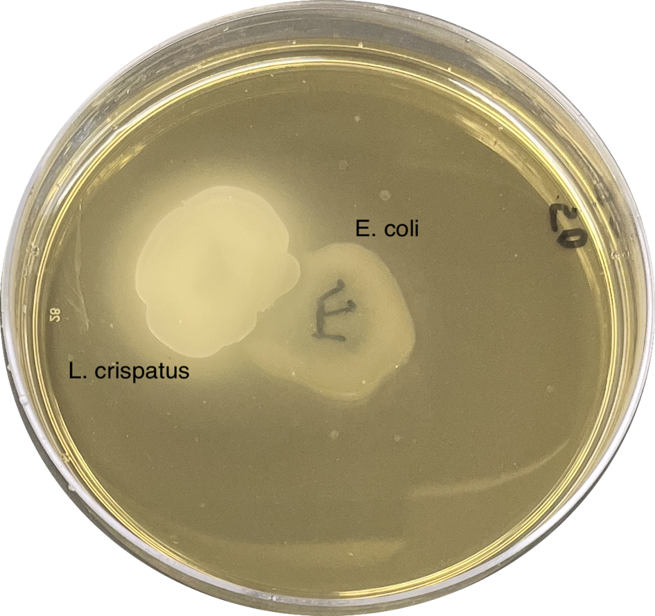
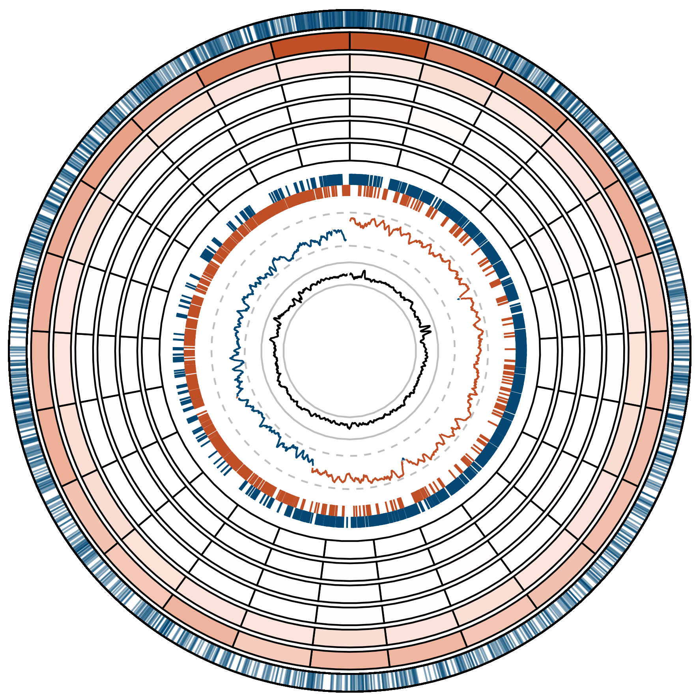

## Current Projects

### Ecology and evolution of urogenital bacteria

::: {style="float: right; margin-left: 15px;"}

:::

Most of the millions of urinary tract infections (UTIs) that occur every year are caused by *Escherichia coli*. To establish an infection, this bacterium must migrate to and survive within the bladder. This means that *E. coli* must contend with competition and antagonism from the commensal microbes inhabiting the bladder and any niche (gut, vagina, etc.) it passes through. A limited but growing body of evidence suggests that lactobacilli, prevalent commensals of the female urogenital tract, may protect women from UTIs through direct antagonism against *E. coli* and/or improving the host immune response. However, some women with active UTIs are colonized with lactobacilli, indicating that *E. coli* might be able to evolve resistance.

Through laboratory adaptation experiments, I have demonstrated that *E. coli* can evolve increased resistance to urinary lactobacilli. Currently, I am working to identify the genetic loci that underlie this adaptation and to characterize clinically relevant trade-offs that might come with increased resistance to lactobacilli. I am also leveraging VUMC's [pathogen biobank](https://www.vumc.org/microvu/welcome) with the help of [Dr. Maria Hadjifrangiskou](https://my.vanderbilt.edu/hadjifrangiskoulab/) to expand the clinical applicability of my findings.

### Mutation rates and spectra of anaerobic bacteria

Mutation is the ultimate source of all genetic variation. Mutagenesis is commonly associated with oxygen, the source of DNA damaging reactive oxygen species. However, life on Earth emerged in an anaerobic environment and evolved in one for over 1 billion years, and many important organisms today remain strict or facultative anaerobes. Understanding mutation in anaerobic environments is essential for understanding our history on this planet and managing the evolution of the microbes that cause infections, ferment our food, and carry out important geochemical processes.

::: {style="float: left; margin-right: 15px;"}

:::

I performed mutation accumulation experiments with anaerobically cultured *Lactobacillus acidophilus*, *Lactobacillus crispatus*, and *Lactococcus lactis* subsp. *lactis*, three anaerobic bacteria used in food fermentation and found in the human microbiome. I found that these organisms have extremely high mutation rates that are consistent with their domesticated and host-associated lifestyles. *L. acidophilus* in particular seems to have undergone a domestication bottleneck that has resulted in the loss of functional DNA repair genes such as *mutS*. Furthermore, I identified intrachromosomal variation in the rate G:C \> A:T transitions, which occur \~3 times as frequently in the \~100 kb around the origin of replication as they do in the rest of the chromosome.

### Collaborations

##### Within-host evolution of bladder bacteria

I work with the [Hadjifrangiskou](https://my.vanderbilt.edu/hadjifrangiskoulab/) and [Schmitz](https://www.vumc.org/schmitzlab/welcome) labs, as well as Dr. Douglass Clayton's urology team at the Vanderbilt Children's Hospital, to understand the evolution of urinary pathogens, especially in patients with spina bifida.

##### Commensal aerotolerance

I work with the [Zhu](https://www.vumc.org/zhu-lab/home) lab to understand how anaerobic commensals in the gut handle the exposure to oxygen that comes with inflammation. We are also applying evolutionary methods to increase the aerotolerance of probiotic strains, which we hope will make them easier to produce and more efficacious.

## Past Projects

### Mycobacterial heme homeostasis

*Mycobacterium tuberculosis* is the second deadliest pathogen and the deadliest bacterium. While progress has been made in fighting tuberculosis, antimicrobial resistance in this pathogen is growing rapidly. The need for new therapies requires us to understand new potential targets. Heme is an essential cofactor required by *M. tuberculosis* for respiration, gas sensing, neutralizing reactive oxygen species, and other processes necessary for pathogenesis. However, the reactivity that makes it so useful as a cofactor also makes it toxic. Free heme can dangerously alter proteins, lipids, and nucleic acids resulting in cell death. Using the model mycobacterium, *Mycobacterium smegmatis*, I identified physiologically relevant conditions that altered heme synthesis and bioavailability. My work on this topic contributed to a larger project driven by Dr. Rebecca Donegan that described idiosyncratic patterns in mycobacterial heme homeostasis and showed that heme synthesis may be a promising drug target.

### Agricultural microbiome engineering

Indigo Agriculture produces staple crop seeds treated with microbes which increase yield and can protect plants from stresses like drought or fungal infection. I screened pairs of microbes for antagonism using *in vitro* and *in planta* assays to determine if they were compatible for coinnoculation. I also contributed to a metabolite function knowledge base to enhance genome motivated microbe nominations.

### Electrophysiology of alcohol addiction

Alcohol addiction is a leading cause of morbidity and mortality and it is believed that binge drinking may play a causal role in its pathogenesis. Working in Dr. Gilles Martin's lab at UMass Medical School, I performed mouse husbandry and set up whole-cell patch clamping experiments aimed at determining how binge drinking may lead to alcohol addiction. I also completed a small project aimed at addressing a major issue common in animal research: the exclusion of female research subjects. Addressing this problem is a [priority](https://orwh.od.nih.gov/sex-gender/nih-policy-sex-biological-variable) of the NIH. My goal was to understand if there is a difference in alcohol consumption between male and female mice so that the lab could confidently move forward with including female mice in future experiments.
